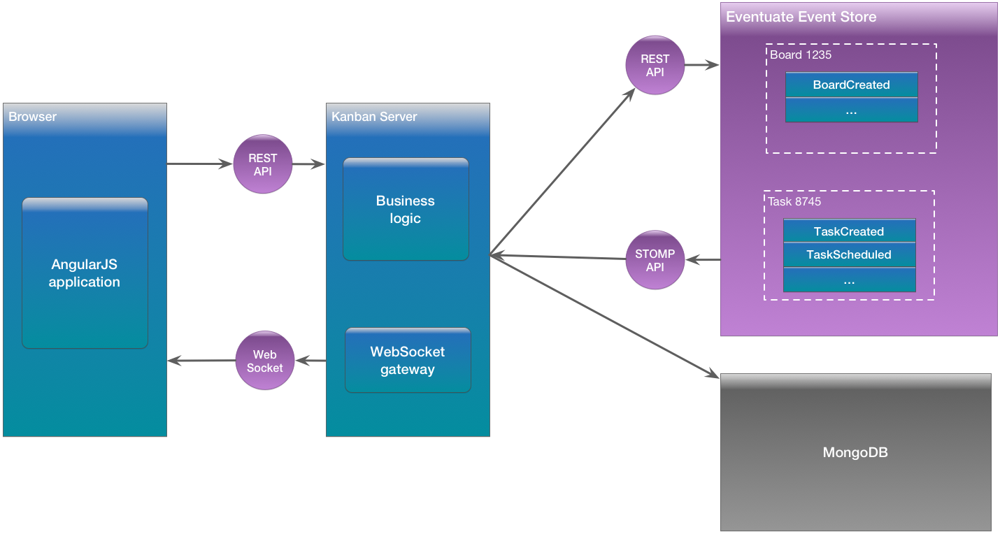
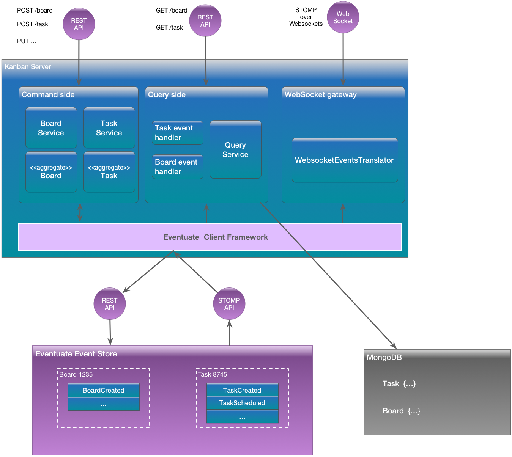
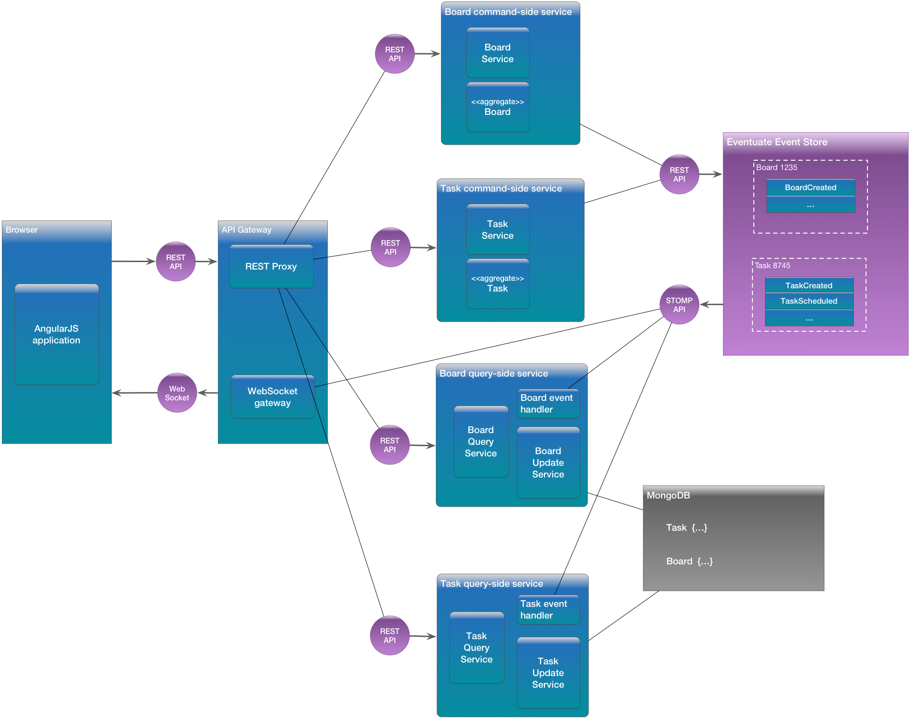

# Real-time, multi-user Kanban Board demo

This sample application, which is written in Java and uses Spring Boot, demonstrates how you can use the [Eventuate&trade; Platform](http://eventuate.io/) to build a real-time, multi-user collaborative application.
The Kanban Board application enables users to collaboratively create and edit Kanban boards and tasks.
Changes made by one user to a board or a task are immediately visible to other users viewing the same board or task.

The Kanban Board application is built using [Eventuate&trade;'s](http://eventuate.io/) Event Sourcing based programming model, which is ideally suited for this kind of application.
The application persists business objects, such as `Boards` and `Tasks`, as a sequence of state changing events.
When a user creates or updates a board or task, the application saves an event in the event store.
The event store delivers each event to interested subscribers.
The Kanban application has a event subscriber that turns each event into WebSocket message that trigger updates in each user's browser.

# Architecture

The following diagram shows the application architecture:



The application consists of the following:

* AngularJS browser application
* Kanban Server - a Java and Spring Boot-based server-side application.
* MongoDB database - stores materialized views of boards and tasks

The Kanban Board server has a Spring MVC-based REST API for creating, updating and querying Kanban boards and tasks.
It also has a STOMP-over-WebSocket API, which pushes updates to boards and tasks to the AngularJS application.
It can be deployed as either a monolithic server or as a set of microservices. Read on to find out more.

# About Eventuate&trade;


[Eventuate](http://eventuate.io/) is a application platform for writing microservices.
It provides a simple yet powerful event-driven programming model that is based on event sourcing and Command Query Responsibility Segregation (CQRS).
Eventuate solves the distributed data management problems inherent in a microservice architecture.
It consists of a scalable, distributed event store server and client libraries for various languages and frameworks including Java, Scala, and the Spring framework. [Learn more.](http://eventuate.io/)


# Kanban Board Server design

The Kanban Board server is written using the [Eventuate Client Framework for Java](http://eventuate.io/docs/java/eventuate-client-framework-for-java.html), which provides an event sourcing based programming model for Java/Spring-Boot aplications.
The server persists boards and tasks as events in the [Eventuate event store](http://eventuate.io/howeventuateworks.html).
The Kanban Board server also maintains a materialized view of boards and tasks in MongoDB.

The following diagram shows the design of the server:



The application is structured using the Command Query Responsibility Segregation (CQRS) pattern.
It consists of the following modules:

*  Command-side module - it handles requests to create and update (e.g. HTTP POST, PUT and DELETE requests) boards and tasks.
The business logic consists of event sourcing based `Board` and `Command` aggregates.

* Query-side module - it handles query requests (ie. HTTP GET requests) by querying a MongoDB materialized view that it maintains.
It consists of an event handler that subscribes to Board and Task events and updates MongoDB.

* WebSocket gateway - it subscribes to Board and Task events published by the event store and republishes them as web socket events.

# Deploy as a monolith or as microservices

The server can either be deployed as a monolith (as shown in the above diagram) or it can be deployed as microservices. The following diagram shows the microservice architecture.



There are the following services:

* API Gateway - routes REST requests to the appropriate backend server, and translates event store events into WebSocket messages.
* Board command side - creates and updates Boards
* Board query side - maintains a denormalized view of boards
* Task command side - creates and updates Tasks
* Board query side - maintains a denormalized view of tasks


# Signing up for Eventuate

To run the Kanban Board application you need credentials for the Eventuate platform.
You can get them by [signing up here](https://signup.eventuate.io/).

# Running MongoDB

In order to run the tests and to run the application you need a MongoDB database.
The easiest way to run MongoDB is with docker-compose:

```
cd java-server/docker-microservices
docker-compose up -d mongodb
```

# Building the application

This application is written using Java 8.
Before building and/or running application, you must set an environment variable that tells the application how to connect to MongoDB:

```
export DOCKER_IP_ADDRESS=$(docker-machine ip default)
export SPRING_DATA_MONGODB_URI=mongodb://${DOCKER_IP_ADDRESS}/mydb
```

You can then build the application using this Gradle command:

```
cd java-server
./gradlew clean build
```

Note: to use Gradle you just need to have the JDK in your path. You do not need to install Gradle.

# Running

Now that you built the application you can run it using these commands:

```
cd java-server/docker-microservices
docker-compose up -d
```

# Using the Kanban board

Open the url `http://${DOCKER_IP_ADDRESS}:8080`, login and create boards and tasks.

# Using the Swagger UI

The individual services are Swagger "enabled".

Open the url `http://${DOCKER_IP_ADDRESS}:<SERVICE-PORT>/swagger-ui.html`

# Got questions?

Don't hesitate to create an issue or [contact us](http://eventuate.io/contact.html).
